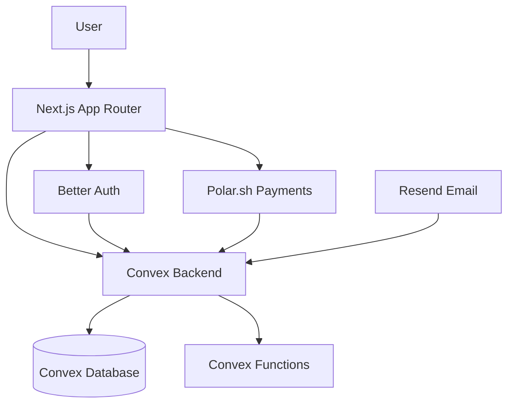

# Next.js SaaS Starter Kit

A complete starter kit template for building [Next.js](https://nextjs.org) SaaS applications powered by **Convex**, **Better Auth**, **Polar.sh**, and **Resend**.

## Demo

See it in action: _Coming soon_

## Architecture



## Stack

- ⚡️ **Framework**: [Next.js 15](https://nextjs.org) with App Router
- ✅ **Language**: [TypeScript](https://www.typescriptlang.org/)
- 🎨 **CSS Framework**: [Tailwind CSS 4](https://tailwindcss.com/)
- 📀 **Database (BaaS)**: [Convex](https://www.convex.dev/) - Real-time database with built-in file storage and serverless functions
- 🔒 **Authentication**: [Better Auth](https://www.better-auth.com/) - Complete authentication with email/password and Google OAuth
- 📧 **Email**: [Resend](https://resend.com/) - Email sending for verification and transactional emails
- 💳 **Billing & Payments**: [Polar.sh](https://polar.sh/) - Manage subscriptions and payments (Merchant of Record)

## Features

- ✅ User authentication with email verification
- ✅ Google OAuth social login
- ✅ Password reset flow
- ✅ Subscription management (recurring payments)
- ✅ One-time product purchases
- ✅ Customer billing portal
- ✅ Webhook handling for payment events
- ✅ Real-time data syncing with Convex

## Prerequisites

### Local Dev Environment

- Node.js version >= 20
- pnpm (recommended), npm, or yarn

### Accounts

Create accounts on the following services:

1. [Convex](https://www.convex.dev/) - Backend database
2. [Polar.sh](https://polar.sh/) - Payments (use Sandbox for testing)
3. [Resend](https://resend.com/) - Email (for email verification)
4. [Google Cloud Console](https://console.cloud.google.com/) - For Google OAuth

### Setting Up Resend (Email)

Resend is used for sending verification and password reset emails.

**Development Testing Options:**

1. **Use your Resend account email** - Without a verified domain, Resend only allows sending to the email address you signed up with. Test by signing up with that exact email.

2. **Verify a domain** (recommended) - For testing with any email:
   - Go to [Resend Domains](https://resend.com/domains)
   - Add your domain and follow the DNS verification steps
   - Update the `from` email in `convex/auth.ts` to use your verified domain:
     ```typescript
     from: "Your App <noreply@yourdomain.com>";
     ```

> **Note**: The `+` email trick (e.g., `email+test@gmail.com`) does NOT work with Resend's unverified account restriction - it requires an exact email match.

### Setting Up Google OAuth

1. Go to [Google Cloud Console](https://console.cloud.google.com/apis/credentials)
2. Create a new project or select an existing one
3. Navigate to **APIs & Services** → **Credentials**
4. Click **Create Credentials** → **OAuth client ID**
5. Select **Web application** as the application type
6. Add authorized redirect URIs:
   - Local development: `http://localhost:3000/api/auth/callback/google`
   - Production: `https://your-domain.com/api/auth/callback/google`
7. Copy the **Client ID** and **Client Secret** for use in environment variables

## Getting Started

### 1. Clone the repository

```bash
git clone <your-repo-url>
cd convex-nextjs-polar-clerk-starter-kit
```

### 2. Install dependencies

```bash
pnpm install
# or
npm install
```

### 3. Environment Setup

Copy the sample environment file:

```bash
cp .env.example .env.local
```

### 4. Configure Environment Variables

Fill in your `.env.local` with the following:

```bash
# Convex (from https://dashboard.convex.dev)
NEXT_PUBLIC_CONVEX_URL=https://your-deployment.convex.cloud
CONVEX_DEPLOYMENT=dev:your-deployment

# Polar.sh (from https://polar.sh/settings/developers)
POLAR_ACCESS_TOKEN=polar_oat_...

# Frontend URL
NEXT_PUBLIC_BASE_URL=http://localhost:3000
```

### 5. Set Convex Dashboard Environment Variables

In your [Convex Dashboard](https://dashboard.convex.dev) → Settings → Environment Variables, add:

```bash
# Generate a secret: openssl rand -base64 32
BETTER_AUTH_SECRET=<your-generated-secret>
SITE_URL=http://localhost:3000

# Polar.sh
POLAR_ORGANIZATION_TOKEN=polar_oat_...
POLAR_WEBHOOK_SECRET=polar_whs_...
POLAR_CUSTOM_WEBHOOK_SECRET=polar_whs_...

# Resend (optional)
RESEND_API_KEY=re_...

# Google OAuth (from https://console.cloud.google.com/apis/credentials)
GOOGLE_CLIENT_ID=...
GOOGLE_CLIENT_SECRET=...
```

Or set them via CLI:

```bash
npx convex env set BETTER_AUTH_SECRET=$(openssl rand -base64 32)
npx convex env set SITE_URL=http://localhost:3000
npx convex env set RESEND_API_KEY=re_...
npx convex env set EMAIL_FROM="My App <onboarding@resend.dev>"
# Set Polar Product IDs
npx convex env set POLAR_PRODUCT_FREE=...
npx convex env set POLAR_PRODUCT_PRO=...
```

### 6. Initialize Convex

```bash
npx convex dev
```

This will:

- Link your project to Convex
- Generate the `convex/_generated` folder
- Start syncing your functions

### 7. Run the development server

In a new terminal:

```bash
pnpm dev
# or
npm run dev
```

Open [http://localhost:3000](http://localhost:3000) to see your app.

### 8. Configure Polar Products

1. Create products in [Polar.sh Dashboard](https://polar.sh) (use Sandbox for testing)
2. On your app's dashboard page, click "Sync Products from Polar"
3. Copy the product IDs that appear
4. Paste them into `convex/polar.ts` in the `products` config object

## Route Structure

| Route                      | Description                                          |
| -------------------------- | ---------------------------------------------------- |
| `/`                        | Homepage with feature cards                          |
| `/about`                   | About page (customize for your product)              |
| `/sample`                  | Demo of auth-protected content patterns              |
| `/auth/sign-in`            | User sign in                                         |
| `/auth/sign-up`            | User registration                                    |
| `/auth/forgot-password`    | Password reset flow                                  |
| `/auth/sign-out`           | Sign out                                             |
| `/dashboard`               | Main dashboard with products and purchases           |
| `/dashboard/settings`      | Account settings (profile, password, delete account) |
| `/dashboard/subscriptions` | Manage active subscriptions                          |
| `/dashboard/paid-only`     | Example of subscription-gated content                |
| `/checkout`                | Polar checkout handler (API route)                   |
| `/portal`                  | Polar customer billing portal (API route)            |

## Database Schema

### Users Table

Managed by Better Auth. User data is accessible via the Convex Dashboard under the "betterAuth" component.

| Field           | Description                    |
| --------------- | ------------------------------ |
| `name`          | User's full name               |
| `email`         | User's email address (indexed) |
| `image`         | Profile image URL              |
| `emailVerified` | Email verification status      |

### Orders Table

Stores one-time purchase orders synced from Polar.

| Field        | Description                    |
| ------------ | ------------------------------ |
| `id`         | Polar Order ID                 |
| `userId`     | Reference to user              |
| `productId`  | Polar Product ID               |
| `priceId`    | Polar Price ID (optional)      |
| `amount`     | Amount in cents                |
| `currency`   | Currency code (e.g., "USD")    |
| `createdAt`  | Order creation timestamp       |
| `modifiedAt` | Last modified timestamp        |
| `status`     | Order status                   |
| `checkoutId` | Polar Checkout ID (optional)   |
| `metadata`   | Additional order data          |

### Component-Managed Tables

The following tables are automatically managed by Convex components and visible in your [Convex Dashboard](https://dashboard.convex.dev):

**Better Auth** (`betterAuth` namespace):
- `user` - Core user data and authentication
- `session` - Active user sessions
- `account` - Linked OAuth accounts
- `verification` - Email verification tokens

**Polar** (`polar` namespace):
- `products` - Synced products from Polar.sh
- `customers` - Customer records linked to users
- `subscriptions` - Active and past subscriptions

**Resend** (`resend` namespace):
- `emails` - Sent email records and delivery status

> These tables are managed internally by the components and shouldn't be modified directly.

## Documentation & References

- [Convex & Better Auth Integration](https://convex-better-auth.netlify.app/)
- [Convex Polar Component](https://www.convex.dev/components/polar)
- [Convex Resend Component](https://www.convex.dev/components/resend)
- [Polar Next.js Adapter](https://polar.sh/docs/integrate/sdk/adapters/nextjs)
- [Better Auth UI Components](https://better-auth-ui.com/)

## Security

- **Environment Variables**: Never commit your `.env.local` file.
- **Authentication**: All sensitive routes are protected by Better Auth middleware.
- **Database**: Convex handles database security with row-level security policies (if configured) and server-side functions.
- **Payments**: Polar.sh handles all payment processing securely. We do not store credit card information.

## Troubleshooting

### Email Sending Fails
- Check your `RESEND_API_KEY`.
- If using an unverified domain, ensure you are sending to the email address associated with your Resend account.
- Verify `EMAIL_FROM` env var is set correctly.

### Polar Sync Issues
- Ensure `POLAR_ORGANIZATION_TOKEN` is correct.
- Check that your product IDs in `.env.local` match those in Polar.
- Verify webhooks are configured correctly in Polar dashboard.

## Deployment

- See [Next.js Deployment Docs](https://nextjs.org/docs/app/getting-started/deploying)
- See [Netlify Next.js Guide](https://docs.netlify.com/build/frameworks/framework-setup-guides/nextjs/overview/)

> **Important**: Remember to set your production environment variables in both your deployment platform AND the Convex Dashboard. Update `SITE_URL` to your production URL.
